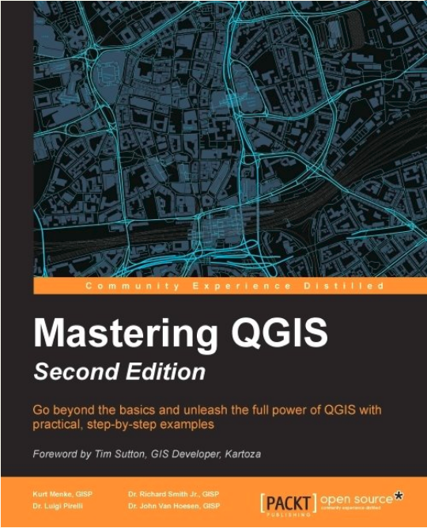
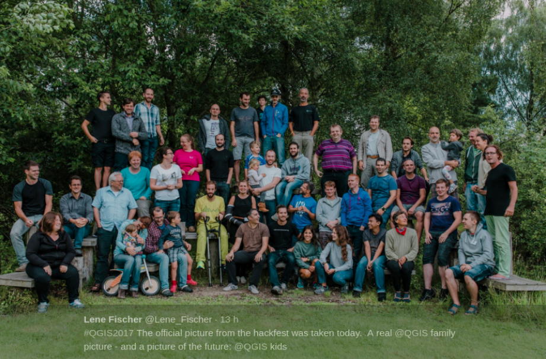

<!-- $theme: default -->

# Quien soy
- Ingeniero informático / Hacker social

- 15 años desarrollando Ground Segments de satélites. Desde Landsat hasta Sentinel

- Desde el 2006 en el mundo de GFOSS con contribuciones a GRASS
Desde entonces trabajando con QGIS

- Cofundador del Italian OSGeo Local Chapter, www.gfoss.it

---
## y en QGIS?
- Contribuyendo al core de QGIS desde años con bug fix y nuevas funcionalidades (WMS legend, SLD, ...)

- Desarrollador y portador (1.8->2.x) de muchos plugins

- Trainer de PyQGIS

- hace poco desarrollando un producto basado en QGIS para BoundlessGeo (EEUU)
  - Miles de instalaciones en la administación de EEUU
  - Plugins para NASA y varias multinacionales

---
# Co-autor de Mastering QGIS (Packt)

---
# Modelo de negocio con QGIS

---
## Se puede vivir vendendo SW libre?

En orden de importancia: Como hacemos negocio con SW Geográfico libre?

1. Customización (adaptar GUI, plugins, añadir botones, facilitar el trabajo)
2. Soporte (Resolver problemas, 24/7 support)
3. Bug Fix (Del core o de plugins)
4. Producto/Paquetización (relacionado con el soporte)
---
## Sanguijuelas o empresas que contribuyen

En General hay que elegir si:
* estar en la comunidad
* ser como la mayoría que usa SW libre sin devolver

### Hay poco grados intermedio. Ejemplo

* devuelvo solo si me da una ventaja de marketing o imagen
* Devuelvo para que lo demás me hagan los  tests
* Devuelvo si me lo permite el cliente (GPL)
* hay mas ???
---
## Casos de éxito de los que están en la comunidad

Hay empresas grandes y pequeñas que basan sus negocios sobre QGIS o GFOSS

* CampToCamp
* OSLandia 
* 3Liz
* SourcePole
* itOpen
* NaturalGIS
* BoundlessGeo ?????
---
# Comunidad de desarrollo y usuarios
---
## Participar, ayudar y recibir ayuda
* Notiifcar fallos - http://hub.qgis.org/issues
* Ayudas - In ML o en freenode #qgis channel
* Lista de fallos: https://github.com/qgis/QGIS/pulls
* Traducír - http://qgis.org/en/site/getinvolved/translate.html
* en Castellano QGIS-es: http://lists.osgeo.org/cgi-bin/mailman/listinfo/qgis-es
---
## Los Hackmeetings

* La parte más divertida
* Se aprende mucho
* Próximo  20-25 February 2018, Madeira (Pt)
---
## Cómo se decide en QGIS	
* PSC es la Dirección general (no técnica)
* Committers
* Un representante para cada UserGroup (y en ES?)
* QEP https://github.com/qgis/QGIS-Enhancement-Proposals
---
# PyQGIS o cómo extender QGIS
---
## Que es PyQGIS

### QGIS is wrote in (www.openhub.net/p/qgis):
* C++ (almos all)
* Python (some core plugins)
* Javascript (some parts in Plugin Manager)
### SIP Bind
95% of C++ API can be accessed by Python thanks to SIP
https://wiki.python.org/moin/SIP
 
PyQGIS Cookbook
http://docs.qgis.org/2.18/en/docs/pyqgis_developer_cookbook/
http://docs.qgis.org/testing/en/docs/pyqgis_developer_cookbook/

---

### APIs
* C++ - http://qgis.org/api/
* Python - http://qgis-python.kartoza.com/docs/
http://geoapis.sourcepole.com/qgispyapi/
https://webgeodatavore.github.io/pyqgis-samples
---
### La mejor escuela: Leer el código de los plugins
Un método de aprendizaje
* Buscar el o los plugins más similares
* Instalarlos
* Estudiar el código en ~/.qgis2/python/plugins/\<plugin name\>
* Hay más de 800 plugins en el repo oficial, y mucho más...
---
## Necesito un Plugin o Uno script de Processing?
* Necesito un plugin? soy capaz?
  * Conocimiento de Python
  * Conocimiento de Programación a Objectos
  * Conocimeintos de QT

* Y si hago uno script de Processing?
  * Solo conocimiento de Python
  * puedo aprender desde otros scripts o modelos
---
## Desde donde empiezo?
* Descarga los plugins similares
* Estudia los scripts de Processing similares
## Optimo es peor que Bueno!
* Escribe un esqueleto de plugin (Pluing Builder plugin)
* Comparte tus errores que la comunidad ayuda
* No esperar que el plugin sea terminado (Frequent demo releases)
---
## Portar desde 2.x a 3.x
Es un buen momento para entrar en el mercado
* Lo de Python:
  * https://docs.python.org/3/howto/pyporting.html
  * http://python-future.org/
  * http://python-future.org/compatible_idioms.html

* Lo de QGIS
  * https://github.com/qgis/QGIS/blob/master/scripts/2to3
---
### Escribir codigo mas compatible
* Abstrár QT4 y QT5
  * from qgis.PyQt import (QtGui, QtCore,...)

    en vez de:

  * from PyQT4 import (QtGui, QtCore,...)
  * from PyQT5 import (QtGui, QtCore,...)

* Nuevas APIs para QGIS3:
  * https://qgis.org/api/api_break.html
---
# Preguntas?
* Luigi Pirelli
* mail: luipir AT gmail DOT com
* twitter: @Ginetto https://twitter.com/Ginetto
* Linkedin: https://www.linkedin.com/in/luigipirelli/
* Alquilame en www.upwork.com: goo.gl/BYRQKg